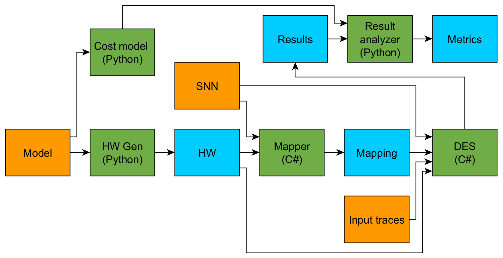

# SpikingDSE
This is a simulator enabling DSE for time-multiplexed neuromorphic hardware. The simulator uses a custom HW model and uses the SRNN networks of [Efficient spiking networks](https://github.com/byin-cwi/Efficient-spiking-networks) as a benchmark.



## Directory Structure
```
├── Simulator/ — Contains the whole simulator's code
│   ├── Scripts/ — Contains various programs besides the DES
│   │   ├── model_cost.py — The cost model
│   │   ├── model_generate_hw.py — HW Generator generates HW specification for DES
│   │   ├── model_metrics.py — Result analyzer
│   │   ├── run_exp.py — Run all benchmarks for a certain experiment
│   │   └── run_map.py — Map all networks for a certain experiment
├── SNNs/ — Code that was used to train the SRNN networks of Efficient spiking networks
│   ├── model.py — Custom implementation of "Efficient spiking networks"'s layers
│   ├── train_x.py — Code to train a certain dataset's networks
│   └── extract_x.py — Code to extract input traces for a certain dataset

```
